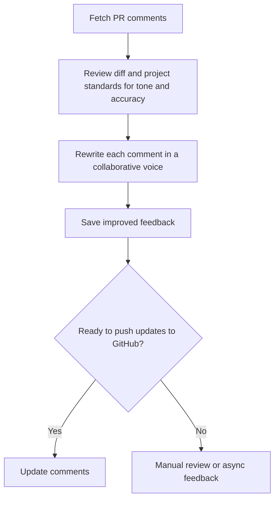
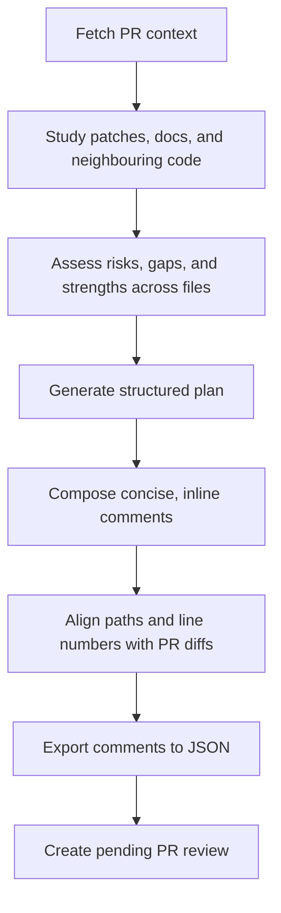
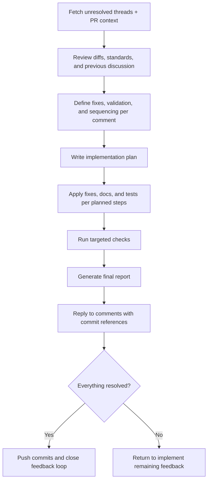

# 🚀 AI Command Library

Stop writing the same AI prompts over and over. Get a library of proven commands for code reviews, PR management, and development workflows that work seamlessly across Claude, Cursor, Copilot, and Codex.

**✅ One install → Works everywhere**
**⚡ Ready-to-use PR workflows**
**🔄 Auto-sync across tools**
**📚 Battle-tested commands**

## 💡 Why This Matters

Every developer faces the same challenges:

- 🔄 **Repetitive AI interactions** - Writing similar prompts for code reviews, documentation, and PR management
- 🎯 **Inconsistent results** - Different team members get different quality from AI tools
- ⏰ **Time waste** - Recreating prompts and workflows across projects
- 🤝 **No collaboration** - Can't easily share effective AI commands with your team

This library solves all of that. You get:

- 📦 **Pre-built workflows** for common development tasks
- 🔧 **Consistent setup** across all your favorite AI tools
- 👥 **Team collaboration** with shared command libraries
- ⚡ **Instant productivity** - no more prompt engineering from scratch

## ⚡ Quick Start

Get your first AI command working in under 2 minutes:

### Option 1: Direct Usage (No Installation)

```bash
# For Claude Desktop/Code
npx @mkaczkowski/ai-command-library -p claude

# For Cursor IDE
npx @mkaczkowski/ai-command-library -p cursor

# For GitHub Copilot Workspace
npx @mkaczkowski/ai-command-library -p copilot

# For Codex CLI
npx @mkaczkowski/ai-command-library -p codex-global
```

### Option 2: Install & Link

```bash
# 1. Install
npm install -D @mkaczkowski/ai-command-library

# 2. Link to your AI tool
npx link-ai-commands --provider claude
```

### Try your first workflow

Now you have powerful PR review commands in your AI tool! Try asking Claude:

> "Use the PR review enhancement workflow to improve my code review comments"

🎉 **Success!** Your AI tools now have access to professional-grade command workflows.

## 🛠 How It Works

Think of this as a **shared collection of AI prompts, skills, and agents organized into logical plugin groups**. Instead of each developer writing their own prompts, you get:

```
plugins/
├── pr/commands/              ← PR workflow commands + scripts
├── debugger/agents/          ← Debugging subagents
├── debugger/skills/          ← Debugging skills
├── jira/commands/            ← JIRA integration
└── common/skills/            ← Shared utilities
       ↓
  link-ai-commands            ← Smart sync tool
       ↓
    .claude/commands/pr/      ← PR commands
    .claude/commands/debugger/ ← Debugger commands
    .claude/commands/jira/    ← JIRA commands
    .claude/skills/           ← All skills
    .claude/agents/           ← All agents
    .cursor/commands/         ← Selective linking
    .github/prompts/          ← Copilot integration
    ~/.codex/prompts/         ← Codex CLI
```

**Key concepts:**

- 📦 **Plugin Groups** - Logical collections of related commands, skills, and agents (e.g., `pr/`, `debugger/`, `jira/`)
- 📝 **Commands** - Markdown files with step-by-step AI instructions organized by group
- 💡 **Skills** - Claude Code Skills for recurring tasks (Claude only)
- 🎯 **Agents** - Claude Code Subagents for specialized tasks (Claude only)
- 🔧 **Providers** - Your AI tools (Claude, Cursor, Copilot, Codex)
- 🔗 **Linking** - Smart copying of specific plugin groups to where your tools can find them
- 🤖 **Scripts** - Helper utilities for GitHub API integration

## 🎯 Choose Your AI Tool

This plugin collection works with all major AI development tools. Pick your setup:

### 🧠 Claude Desktop / Claude Code

**Best for:** Individual developers, project-specific commands, skills, and agents

```bash
npx link-ai-commands --provider claude
```

- **Result:** Commands appear in `.claude/commands/`, Skills appear in `.claude/skills/`, Agents appear in `.claude/agents/`
- **What you get:** PR workflows + reusable skills + specialized subagents accessible via Claude's command palette

### 💻 Cursor IDE

**Best for:** Teams using Cursor, integrated development

```bash
npx link-ai-commands --provider cursor
```

- **Result:** Commands appear in `.cursor/commands/`
- **What you get:** AI commands directly in your IDE

### 🤖 GitHub Copilot Workspace

**Best for:** Developers using GitHub Copilot with shared project workflows

```bash
npx link-ai-commands --provider copilot
```

- **Result:** Commands appear in `.github/prompts/`
- **What you get:** Flattened `.prompt.md` files ready for Copilot Workspace

### ⚙️ Codex CLI

**Best for:** Terminal workflows, automation scripts

```bash
npx link-ai-commands --provider codex-global
```

- **Result:** Commands appear in `~/.codex/prompts/`
- **What you get:** Command-line AI automation

### 🔧 Advanced Options

**Install specific plugin groups only:**

```bash
# Install only PR and debugger workflows
npx link-ai-commands --provider claude --plugins pr,debugger
```

**List all available plugin groups:**

```bash
npx link-ai-commands --list-groups
```

**Use symlinks (live updates):**

```bash
npx link-ai-commands --provider claude --mode symlink
```

**Preview before linking:**

```bash
npx link-ai-commands --provider claude --dry-run
```

**See all available providers:**

```bash
npx link-ai-commands --list-providers
```

## 📋 Prerequisites

- **Node.js 22+** and **npm 10+**
- **[GitHub CLI](https://cli.github.com/)** for PR workflows
  - Run `gh auth login` and ensure `repo` scope is granted
  - Enterprise users: set `GH_HOST` or use `--repo` flags

### ⚡ Alternative Installation

Install directly from GitHub:

```bash
npm install -D git+https://github.com/mkaczkowski/ai-command-library.git
```

> 📋 **Provider Reference Table**

| Provider        | Destination                                                    | Skills | Agents | Best For                                             |
| --------------- | -------------------------------------------------------------- | ------ | ------ | ---------------------------------------------------- |
| `claude`        | `.claude/commands` + `.claude/skills` + `.claude/agents`       | ✅     | ✅     | Project-specific Claude commands, skills, and agents |
| `claude-global` | `~/.claude/commands` + `~/.claude/skills` + `~/.claude/agents` | ✅     | ✅     | User-wide Claude setup                               |
| `cursor`        | `.cursor/commands`                                             | ❌     | ❌     | Project-specific Cursor commands                     |
| `cursor-global` | `~/.cursor/commands`                                           | ❌     | ❌     | User-wide Cursor setup                               |
| `copilot`       | `.github/prompts`                                              | ❌     | ❌     | Project-specific Copilot prompts                     |
| `codex-global`  | `~/.codex/prompts`                                             | ❌     | ❌     | Terminal-based AI workflows                          |

> 📝 **Skills:** Only available for Claude providers. Both project skills (`.claude/skills/`) and global skills (`~/.claude/skills/`) are automatically synced when linking.
> 📝 **Agents:** Only available for Claude providers. Both project agents (`.claude/agents/`) and global agents (`~/.claude/agents/`) are automatically synced when linking.
> 📝 **Special note for Codex:** Commands are flattened to single filenames (e.g., `pr__enhance-review.md`) while scripts stay in folders. The linker prevents naming conflicts.
> 📝 **Special note for Copilot:** Prompts are flattened to hyphenated names ending in `.prompt.md`, while `scripts/` keep their directory structure.

## 🔄 Script Integration

Commands can reference helper scripts using placeholder syntax that works across all providers:

```bash
# This works everywhere:
node {{script:pr/scripts/fetch-pr-comments.js}} --pr=123

# Resolves to:
# Claude: .claude/commands/pr/scripts/fetch-pr-comments.js
# Cursor: .cursor/commands/pr/scripts/fetch-pr-comments.js
# Copilot: .github/prompts/pr/scripts/fetch-pr-comments.js
# Codex: ~/.codex/prompts/pr/scripts/fetch-pr-comments.js
```

**Path placeholders:**

- `{{script:path/to/script.js}}` - References helper scripts
- `{{path:commandsRoot}}` - References the commands directory

## 📋 Common Workflows

Ready-to-use workflows that solve real development problems. Each workflow includes commands plus helper scripts for GitHub integration.

> 💡 **How to use:** After linking commands to your AI tool, reference these workflows in your conversations. Helper scripts gather the data your AI needs to provide accurate, actionable guidance.

### 🔧 Enhance Existing Comments

**Problem:** Your code review comments are technically accurate but sound harsh or overly critical.

**Solution:** Transform blunt feedback into collaborative, constructive guidance while preserving all technical requirements.

**What you get:**

- ✨ Professional, collaborative tone
- 🎯 Same technical accuracy
- 👥 Better team relationships
- ⚡ Consistent review quality

#### Step 1: Rewrite Comments (`pr/enhance-review.md` — Step 1)

**When to use:** After writing initial review comments but before posting them.

```bash
# First, gather existing comments
node {{script:pr/scripts/fetch-pr-comments.js}} --pr=123

# Then ask your AI:
# "Use the comment enhancement workflow to improve my review tone"
```

**What happens:** Your AI reads your draft comments and rewrites them to sound more collaborative while keeping all technical points intact.

**Output:** Polished comments ready for posting (`tmp/pr-[PR_NUMBER]-comments.md`)

#### Step 2: Update Comments (`pr/enhance-review.md` — Step 2)

**When to use:** After reviewing and approving your enhanced comments.

```bash
# Generate update instructions for GitHub
# (Your AI will guide you through this)

# Apply the updates
node {{script:pr/scripts/edit-pr-comments.js}} --pr=123
```

**What happens:** Your enhanced comments replace the original ones on GitHub, automatically maintaining the same technical accuracy with better tone.

<details>
<summary>📊 <strong>Workflow Diagram</strong></summary>



</details>

### ✍️ Create New Review Comments

**Problem:** You need to provide a thorough code review but don't want to miss important issues or spend hours crafting detailed feedback.

**Solution:** AI-powered systematic review that catches issues you might miss and generates professional, actionable comments.

**What you get:**

- 🔍 Comprehensive issue detection
- 📝 Professional, helpful comment text
- ⚡ Faster review process
- 🎯 Consistent review quality across your team

#### Step 1: Prepare Review (`pr/draft-review.md` — Step 1)

**When to use:** When you need to review a new PR thoroughly.

```bash
# Gather PR context and changes
node {{script:pr/scripts/fetch-pr-context.js}} --pr=123

# Then ask your AI:
# "Use the review preparation workflow to analyze this PR"
```

**What happens:** Your AI systematically reviews the entire PR, cataloging potential issues, improvements, and positive points.

**Output:** Structured findings ready to convert into GitHub comments (`tmp/pr-[PR_NUMBER]-findings.md`)

#### Step 2: Create Review (`pr/draft-review.md` — Step 2)

**When to use:** After preparing your review findings.

```bash
# Generate GitHub-ready comments
# (Your AI will guide you through this)

# Post the review to GitHub
node {{script:pr/scripts/create-pr-review.js}} --input=tmp/pr-123-review-comments.json --pr=123
```

**What happens:** Your AI converts findings into polished GitHub comments with proper file/line mappings.

**Output:** Professional review comments posted to GitHub

<details>
<summary>📊 <strong>Workflow Diagram</strong></summary>



</details>

### ✨ Create Pull Requests

**Problem:** Creating well-documented PRs is time-consuming, and incomplete descriptions make reviews harder and slower.

**Solution:** Automated PR description generation that analyzes your changes and populates the project's PR template with meaningful, concise information.

**What you get:**

- 📝 Auto-populated PR template from your `.github/PULL_REQUEST_TEMPLATE.md`
- 🔍 Smart analysis of commits, diffs, and code changes
- 🎯 Extraction of Jira tickets, dependencies, and test coverage
- ⚡ Reviewer-friendly descriptions that speed up reviews

#### Create PR (`pr/create-pr.md`)

**When to use:** When you're ready to create a pull request from your feature branch.

```bash
# Option 1: Let AI analyze your changes
# Ask your AI:
# "Use the create PR workflow to draft my pull request"

# Option 2: Provide context upfront
# "Use the create PR workflow. I added a user search feature that debounces
#  input to reduce API calls and improve performance."
```

**What happens:** Your AI:

1. Reads your project's PR template from `.github/PULL_REQUEST_TEMPLATE.md`
2. Analyzes commits, diffs, and code changes since diverging from `main`
3. Extracts tickets from branch name or commits
4. Identifies new/updated dependencies
5. Determines test coverage and generates testing instructions
6. Populates the template with concise, reviewer-friendly content
7. Shows you the draft for approval
8. Creates the PR using `gh pr create`

**What you need to provide:**

- Optionally: High-level description of your changes (AI will supplement with technical details)
- Confirmation after reviewing the generated PR description

**Output:** Pull request created on GitHub with comprehensive description

### 🔄 Address Review Feedback

**Problem:** You have review feedback to address but need to ensure you handle every comment systematically and respond appropriately.

**Solution:** Structured approach to analyzing, implementing, and tracking resolution of all review feedback.

**What you get:**

- 📋 Systematic tracking of all feedback
- ✅ Nothing gets missed or forgotten
- 🎯 Appropriate responses to reviewers
- ⚡ Faster resolution cycles

#### Step 1: Plan Resolutions (`pr/address-review.md` — Step 1)

**When to use:** When you have unresolved review comments to address.

```bash
# Get latest feedback with reactions
node {{script:pr/scripts/fetch-pr-comments.js}} --reaction=+1 --ignore-outdated --include-diff-hunk --pr=123

# Then ask your AI:
# "Use the resolution planning workflow to address this feedback"
```

**What happens:** Your AI creates a systematic plan for addressing each piece of feedback.

**Output:** Implementation plan with validation steps (`tmp/pr-[PR_NUMBER]-address-plan.md`)

#### Step 2: Implement Changes (`pr/address-review.md` — Step 2)

**When to use:** After your resolution plan is approved.

```bash
# Follow your AI-generated plan to implement changes
# (Your AI will guide you through each step)
```

**What happens:** Your AI helps you implement each planned change and validates the results.

**Output:** Detailed resolution report with commit references (`tmp/pr-[PR_NUMBER]-address-report.md`)

#### Step 3: Reply to Comments (`pr/address-review.md` — Step 3)

**When to use:** After implementing fixes to close the feedback loop.

```bash
# Reply to resolved comments with commit references
node {{script:pr/scripts/reply-to-comments.js}} --pr=123 --dry-run

# When ready, apply the replies
node {{script:pr/scripts/reply-to-comments.js}} --pr=123
```

**What happens:** Courteous acknowledgments are posted to each resolved comment thread with links to the implementing commits.

<details>
<summary>📊 <strong>Complete Address Workflow</strong></summary>



</details>

### 🐞 File Jira Bug Reports

**Problem:** You need to capture production bugs quickly without sacrificing the detail Jira requires.

**Solution:** Guided interview that drafts the full ticket and prepares a ready-to-run `jira-cli` command.

**What you get:**

- 🧾 Complete, emoji-free Jira description with bold section headers
- 🔁 Reproduction steps, expected vs. observed behavior, and environment details
- ⚙️ Shell-safe `jira issue create` command you can paste into the terminal

#### Step 1: Draft Ticket (`jira/create-bug.template.md`)

**When to use:** As soon as a bug is confirmed and you’re ready to file it in Jira.

**Prerequisite:** Install [`jira-cli`](https://github.com/ankitpokhrel/jira-cli) and authenticate it with your JIRA_API_TOKEN.

**What happens:** The command collects summary, reproduction steps, environment, and evidence, formats them for Jira, and outputs:

1. Actionable summary text
2. Markdown description wrapped in a code fence
3. A `jira issue create` command with the populated description (using `-tBug`, `-s"<SUMMARY>"`, and `-b"<DESCRIPTION BLOCK>"` with embedded newlines)

**Output:** Ready-to-file summary, description, and CLI command (`jira issue create ... --no-input`)

### ⚙️ File Jira Technical Debt Tickets

**Problem:** You need to track technical debt systematically but want structured tickets without manual Jira form-filling.

**Solution:** Guided workflow that drafts a complete technical debt ticket with What/Where/Why structure and acceptance criteria.

**What you get:**

- 📋 Structured technical debt description (What, Where, Why, Acceptance Criteria)
- 🎯 Project-agnostic template that adapts to your Jira setup
- ⚙️ Shell-safe `jira issue create` command ready to execute

#### Draft Technical Debt Ticket (`jira/create-tech-debt.template.md`)

**When to use:** When you identify technical debt that needs tracking (refactoring, upgrades, migrations, improvements).

**Prerequisite:** Install [`jira-cli`](https://github.com/ankitpokhrel/jira-cli) and authenticate it with your JIRA_API_TOKEN.

**What happens:** The command collects:

1. What technical work needs to be done
2. Where in the codebase it's located
3. Why it matters (business or technical justification)
4. Testable acceptance criteria
5. Priority, labels, and optional parent epic

Then outputs a `jira issue create` command with configurable issue type (e.g., "Task", "Technical Requirement", "Story").

**Output:** Ready-to-file technical debt ticket command (`jira issue create -t"<ISSUE_TYPE>" ... --no-input`)

### 🧪 File Jira Flaky Test Reports

**Problem:** Flaky tests need systematic investigation and fixes, but capturing all the diagnostic details is time-consuming.

**Solution:** Guided template that helps you document test failures comprehensively with reproduction steps and potential causes.

**What you get:**

- 🔍 Complete test identification (file path, scenario, test suite)
- 📊 Failure symptoms with exact error messages
- 🔄 Reproduction commands and potential root causes
- 🔗 Evidence links (CI/CD runs, logs, stack traces)

#### Draft Flaky Test Ticket (`jira/create-flaky-test.template.md`)

**When to use:** When a test exhibits intermittent failures that need investigation and stabilization.

**Prerequisite:** Install [`jira-cli`](https://github.com/ankitpokhrel/jira-cli) and authenticate it with your JIRA_API_TOKEN.

**What happens:** The command collects:

1. Test identification (file path, scenario name, test suite)
2. Failure symptoms (error messages, timeouts, inconsistent behavior)
3. Exact reproduction command
4. Potential causes (timing issues, race conditions, environment)
5. Evidence (CI/CD links, logs, stack traces)

Then outputs a `jira issue create` command with configurable issue type and optional parent epic.

**Output:** Ready-to-file flaky test ticket command (`jira issue create -t"<ISSUE_TYPE>" ... --no-input`)

## 🤖 Helper Scripts Reference

The workflows above use helper scripts to integrate with GitHub. These scripts handle API calls, data processing, and file management automatically.

<details>
<summary><strong>📥 Data Fetching Scripts</strong></summary>

- **`fetch-pr-comments.js`** - Get review comments with filtering options
- **`fetch-pr-context.js`** - Gather PR metadata, files, commits, and participants

```bash
# Examples
node {{script:pr/scripts/fetch-pr-comments.js}} --pr=123 --reaction=+1
node {{script:pr/scripts/fetch-pr-context.js}} --pr=123
```

</details>

<details>
<summary><strong>📤 GitHub Integration Scripts</strong></summary>

- **`create-pr-review.js`** - Submit comment JSON as GitHub review
- **`edit-pr-comments.js`** - Update existing comments with enhanced versions
- **`reply-to-comments.js`** - Post resolution acknowledgments to comment threads

```bash
# Examples
node {{script:pr/scripts/create-pr-review.js}} --input=tmp/pr-123-review-comments.json --pr=123
node {{script:pr/scripts/edit-pr-comments.js}} --input=tmp/pr-123-comments.json
node {{script:pr/scripts/reply-to-comments.js}} --input=tmp/pr-123-address-resolved.json --dry-run
```

</details>

> 💡 **Tip:** All scripts support `--help` to show available options and usage examples.

## 🔄 Automation & Integration

### Keep Commands Updated

Add automatic syncing to your project workflow:

```json
{
  "scripts": {
    "postinstall": "link-ai-commands --provider claude"
  }
}
```

### Multi-Tool Setup

Using multiple AI tools? Run once per provider:

```bash
npx link-ai-commands --provider claude    # For Claude
npx link-ai-commands --provider cursor    # For Cursor
```

## 🛠 Development & Contributing

Want to contribute or customize the library? Here's how to get started:

### Setup

```bash
git clone https://github.com/mkaczkowski/ai-command-library.git
cd ai-command-library
npm install
```

### Code Quality

Run checks before committing:

```bash
npm run lint           # Check code style
npm run format:check   # Verify formatting
```

Auto-fix issues:

```bash
npm run lint:fix       # Fix linting issues
npm run format         # Apply consistent formatting
```

### 📁 Repository Structure

```
ai-command-library/
├── plugins/              # 📦 Plugin groups
│   ├── pr/              # PR workflow commands + scripts
│   ├── debugger/        # Debugging agents + skills
│   ├── jira/            # JIRA integration
│   └── common/          # Shared utilities (skills)
├── providers/           # ⚙️ Provider configurations (claude.json, cursor.json)
├── scripts/             # 🔧 Core linking logic
└── bin/                 # 📦 CLI entry point
```

### 📚 Plugin Organization

The plugins are organized into **groups**, where each group can contain commands, skills, and/or agents:

- **pr/** - Pull request workflow tools and utilities
- **debugger/** - Debugging and analysis agents, plus parallel debugging skill
- **jira/** - JIRA ticket creation and management
- **common/** - Cross-cutting utilities (commit helper skill, etc.)

Each group follows the structure:

```
{group}/
├── commands/      # Optional: Markdown command templates + supporting scripts
├── skills/        # Optional: Claude Code Skills (SKILL.md + supporting files)
└── agents/        # Optional: Claude Code Subagents (markdown files with YAML frontmatter)
```

### 🚀 Release Process

1. **Update:** Bump version in `package.json` and update `CHANGELOG.md`
2. **Verify:** Run `npm run release` to check linting and formatting
3. **Publish:** `npm publish --access public` (requires NPM_TOKEN env var)
4. **Tag:** Push the release commit and tag to GitHub

## 🤝 Support & Community

### 🐛 Found an Issue?

- **Bug reports:** [GitHub Issues](https://github.com/mkaczkowski/ai-command-library/issues)
- **Feature requests:** [GitHub Issues](https://github.com/mkaczkowski/ai-command-library/issues)
- **Security concerns:** Follow guidance in [`SECURITY.md`](SECURITY.md)

### 💡 Need Help?

- Check the workflows above for common use cases
- Review script help with `--help` flag
- Search existing issues for solutions

### 🎯 Contributing

- Add new command workflows
- Improve existing templates
- Enhance provider support
- Update documentation

---

## 📄 License

Released under the [MIT License](LICENSE).

**Happy coding!** 🚀
