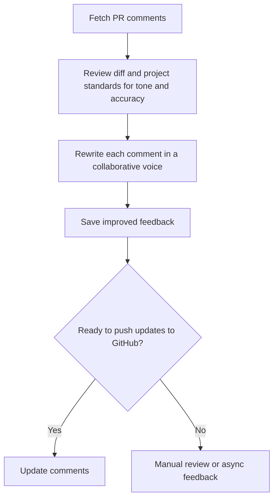
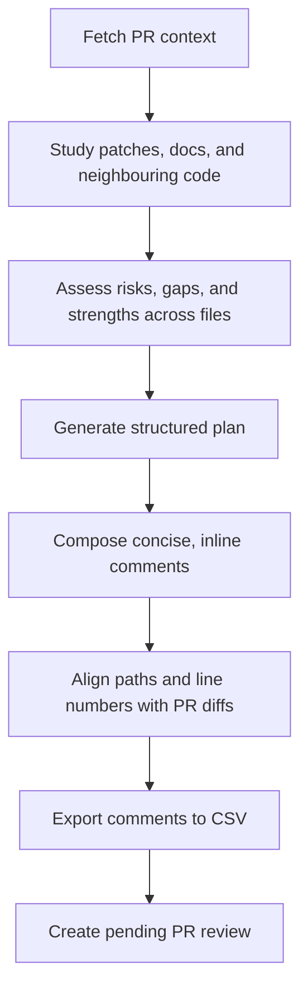
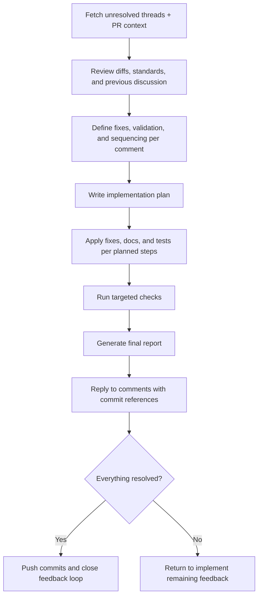

# 🚀 AI Command Library

Stop writing the same AI prompts over and over. Get a library of proven commands for code reviews, PR management, and development workflows that work seamlessly across Claude, Cursor, Copilot, and Codex.

**✅ One install → Works everywhere**
**⚡ Ready-to-use PR workflows**
**🔄 Auto-sync across tools**
**📚 Battle-tested commands**

## 💡 Why This Matters

Every developer faces the same challenges:

- 🔄 **Repetitive AI interactions** - Writing similar prompts for code reviews, documentation, and PR management
- 🎯 **Inconsistent results** - Different team members get different quality from AI tools
- ⏰ **Time waste** - Recreating prompts and workflows across projects
- 🤝 **No collaboration** - Can't easily share effective AI commands with your team

This library solves all of that. You get:

- 📦 **Pre-built workflows** for common development tasks
- 🔧 **Consistent setup** across all your favorite AI tools
- 👥 **Team collaboration** with shared command libraries
- ⚡ **Instant productivity** - no more prompt engineering from scratch

## ⚡ Quick Start

Get your first AI command working in under 2 minutes:

### Option 1: Direct Usage (No Installation)

```bash
# For Claude Desktop/Code
npx @mkaczkowski/ai-command-library -p claude

# For Cursor IDE
npx @mkaczkowski/ai-command-library -p cursor

# For GitHub Copilot Workspace
npx @mkaczkowski/ai-command-library -p copilot

# For Codex CLI
npx @mkaczkowski/ai-command-library -p codex-global
```

### Option 2: Install & Link

```bash
# 1. Install
npm install -D @mkaczkowski/ai-command-library

# 2. Link to your AI tool
npx link-ai-commands --provider claude
```

### Try your first workflow

Now you have powerful PR review commands in your AI tool! Try asking Claude:

> "Use the PR review enhancement workflow to improve my code review comments"

🎉 **Success!** Your AI tools now have access to professional-grade command workflows.

## 🛠 How It Works

Think of this as a **shared library for AI prompts**. Instead of each developer writing their own prompts, you get:

```
library/commands/         ← Proven command templates
       ↓
  link-ai-commands        ← Smart sync tool
       ↓
    .claude/commands/     ← Ready to use in Claude
    .cursor/commands/     ← Ready to use in Cursor
    .copilot/commands/    ← Ready to use in Copilot
    ~/.codex/prompts/     ← Ready to use in Codex
```

**Key concepts:**

- 📝 **Commands** - Markdown files with step-by-step AI instructions
- 🔧 **Providers** - Your AI tools (Claude, Cursor, Copilot, Codex)
- 🔗 **Linking** - Copying commands to where your tools can find them
- 🤖 **Scripts** - Helper utilities for GitHub API integration

## 🎯 Choose Your AI Tool

The library works with all major AI development tools. Pick your setup:

### 🧠 Claude Desktop / Claude Code

**Best for:** Individual developers, project-specific commands

```bash
npx link-ai-commands --provider claude
```

- **Result:** Commands appear in `.claude/commands/`
- **What you get:** PR workflows accessible via Claude's command palette

### 💻 Cursor IDE

**Best for:** Teams using Cursor, integrated development

```bash
npx link-ai-commands --provider cursor
```

- **Result:** Commands appear in `.cursor/commands/`
- **What you get:** AI commands directly in your IDE

### 🤖 GitHub Copilot Workspace

**Best for:** Developers using GitHub Copilot with shared project workflows

```bash
npx link-ai-commands --provider copilot
```

- **Result:** Commands appear in `.copilot/commands/`
- **What you get:** Copilot-friendly command palette entries

### ⚙️ Codex CLI

**Best for:** Terminal workflows, automation scripts

```bash
npx link-ai-commands --provider codex-global
```

- **Result:** Commands appear in `~/.codex/prompts/`
- **What you get:** Command-line AI automation

### 🔧 Advanced Options

**Link to custom location:**

```bash
npx link-ai-commands --provider claude --destination ./my-commands
```

**Use symlinks (live updates):**

```bash
npx link-ai-commands --provider claude --mode symlink
```

**Preview before linking:**

```bash
npx link-ai-commands --provider claude --dry-run
```

**See all available providers:**

```bash
npx link-ai-commands --list-providers
```

## 📋 Prerequisites

- **Node.js 22+** and **npm 10+**
- **[GitHub CLI](https://cli.github.com/)** for PR workflows
  - Run `gh auth login` and ensure `repo` scope is granted
  - Enterprise users: set `GH_HOST` or use `--repo` flags

### ⚡ Alternative Installation

Install directly from GitHub:

```bash
npm install -D git+https://github.com/mkaczkowski/ai-command-library.git
```

> 📋 **Provider Reference Table**

| Provider        | Destination          | Best For                         |
| --------------- | -------------------- | -------------------------------- |
| `claude`        | `.claude/commands`   | Project-specific Claude commands |
| `claude-global` | `~/.claude/commands` | User-wide Claude setup           |
| `cursor`        | `.cursor/commands`   | Project-specific Cursor commands |
| `cursor-global` | `~/.cursor/commands` | User-wide Cursor setup           |
| `copilot`       | `.copilot/commands`  | Project-specific Copilot commands |
| `codex-global`  | `~/.codex/prompts`   | Terminal-based AI workflows      |

> 📝 **Special note for Codex:** Commands are flattened to single filenames (e.g., `pr__enhance-review.md`) while scripts stay in folders. The linker prevents naming conflicts.

## 🔄 Script Integration

Commands can reference helper scripts using placeholder syntax that works across all providers:

```bash
# This works everywhere:
node {{script:pr/scripts/fetch-pr-comments.js}} --pr=123

# Resolves to:
# Claude: .claude/commands/pr/scripts/fetch-pr-comments.js
# Cursor: .cursor/commands/pr/scripts/fetch-pr-comments.js
# Copilot: .copilot/commands/pr/scripts/fetch-pr-comments.js
# Codex: ~/.codex/prompts/pr/scripts/fetch-pr-comments.js
```

**Path placeholders:**

- `{{script:path/to/script.js}}` - References helper scripts
- `{{path:commandsRoot}}` - References the commands directory

## 📋 Common Workflows

Ready-to-use workflows that solve real development problems. Each workflow includes commands plus helper scripts for GitHub integration.

> 💡 **How to use:** After linking commands to your AI tool, reference these workflows in your conversations. Helper scripts gather the data your AI needs to provide accurate, actionable guidance.

### 🔧 Enhance Existing Comments

**Problem:** Your code review comments are technically accurate but sound harsh or overly critical.

**Solution:** Transform blunt feedback into collaborative, constructive guidance while preserving all technical requirements.

**What you get:**

- ✨ Professional, collaborative tone
- 🎯 Same technical accuracy
- 👥 Better team relationships
- ⚡ Consistent review quality

#### Step 1: Rewrite Comments (`pr/enhance-review.md` — Step 1)

**When to use:** After writing initial review comments but before posting them.

```bash
# First, gather existing comments
node {{script:pr/scripts/fetch-pr-comments.js}} --pr=123

# Then ask your AI:
# "Use the comment enhancement workflow to improve my review tone"
```

**What happens:** Your AI reads your draft comments and rewrites them to sound more collaborative while keeping all technical points intact.

**Output:** Polished comments ready for posting (`tmp/pr-[PR_NUMBER]-comments.md`)

#### Step 2: Update Comments (`pr/enhance-review.md` — Step 2)

**When to use:** After reviewing and approving your enhanced comments.

```bash
# Generate update instructions for GitHub
# (Your AI will guide you through this)

# Apply the updates
node {{script:pr/scripts/edit-pr-comments.js}} --pr=123
```

**What happens:** Your enhanced comments replace the original ones on GitHub, automatically maintaining the same technical accuracy with better tone.

<details>
<summary>📊 <strong>Workflow Diagram</strong></summary>



</details>

### ✍️ Create New Review Comments

**Problem:** You need to provide a thorough code review but don't want to miss important issues or spend hours crafting detailed feedback.

**Solution:** AI-powered systematic review that catches issues you might miss and generates professional, actionable comments.

**What you get:**

- 🔍 Comprehensive issue detection
- 📝 Professional, helpful comment text
- ⚡ Faster review process
- 🎯 Consistent review quality across your team

#### Step 1: Prepare Review (`pr/draft-review.md` — Step 1)

**When to use:** When you need to review a new PR thoroughly.

```bash
# Gather PR context and changes
node {{script:pr/scripts/fetch-pr-context.js}} --pr=123

# Then ask your AI:
# "Use the review preparation workflow to analyze this PR"
```

**What happens:** Your AI systematically reviews the entire PR, cataloging potential issues, improvements, and positive points.

**Output:** Structured findings ready to convert into GitHub comments (`tmp/pr-[PR_NUMBER]-findings.md`)

#### Step 2: Create Review (`pr/draft-review.md` — Step 2)

**When to use:** After preparing your review findings.

```bash
# Generate GitHub-ready comments
# (Your AI will guide you through this)

# Post the review to GitHub
node {{script:pr/scripts/create-pr-review.js}} --pr=123
```

**What happens:** Your AI converts findings into polished GitHub comments with proper file/line mappings.

**Output:** Professional review comments posted to GitHub

<details>
<summary>📊 <strong>Workflow Diagram</strong></summary>



</details>

### 🔄 Address Review Feedback

**Problem:** You have review feedback to address but need to ensure you handle every comment systematically and respond appropriately.

**Solution:** Structured approach to analyzing, implementing, and tracking resolution of all review feedback.

**What you get:**

- 📋 Systematic tracking of all feedback
- ✅ Nothing gets missed or forgotten
- 🎯 Appropriate responses to reviewers
- ⚡ Faster resolution cycles

#### Step 1: Plan Resolutions (`pr/address-review.md` — Step 1)

**When to use:** When you have unresolved review comments to address.

```bash
# Get latest feedback with reactions
node {{script:pr/scripts/fetch-pr-comments.js}} --reaction=+1 --ignore-outdated --include-diff-hunk --pr=123

# Then ask your AI:
# "Use the resolution planning workflow to address this feedback"
```

**What happens:** Your AI creates a systematic plan for addressing each piece of feedback.

**Output:** Implementation plan with validation steps (`tmp/pr-[PR_NUMBER]-address-plan.md`)

#### Step 2: Implement Changes (`pr/address-review.md` — Step 2)

**When to use:** After your resolution plan is approved.

```bash
# Follow your AI-generated plan to implement changes
# (Your AI will guide you through each step)
```

**What happens:** Your AI helps you implement each planned change and validates the results.

**Output:** Detailed resolution report with commit references (`tmp/pr-[PR_NUMBER]-address-report.md`)

#### Step 3: Reply to Comments (`pr/address-review.md` — Step 3)

**When to use:** After implementing fixes to close the feedback loop.

```bash
# Reply to resolved comments with commit references
node {{script:pr/scripts/reply-to-comments.js}} --pr=123 --dry-run

# When ready, apply the replies
node {{script:pr/scripts/reply-to-comments.js}} --pr=123
```

**What happens:** Courteous acknowledgments are posted to each resolved comment thread with links to the implementing commits.

<details>
<summary>📊 <strong>Complete Address Workflow</strong></summary>



</details>

## 🤖 Helper Scripts Reference

The workflows above use helper scripts to integrate with GitHub. These scripts handle API calls, data processing, and file management automatically.

<details>
<summary><strong>📥 Data Fetching Scripts</strong></summary>

- **`fetch-pr-comments.js`** - Get review comments with filtering options
- **`fetch-pr-context.js`** - Gather PR metadata, files, commits, and participants

```bash
# Examples
node {{script:pr/scripts/fetch-pr-comments.js}} --pr=123 --reaction=+1
node {{script:pr/scripts/fetch-pr-context.js}} --pr=123
```

</details>

<details>
<summary><strong>📤 GitHub Integration Scripts</strong></summary>

- **`create-pr-review.js`** - Submit comment CSV as GitHub review
- **`edit-pr-comments.js`** - Update existing comments with enhanced versions
- **`reply-to-comments.js`** - Post resolution acknowledgments to comment threads

```bash
# Examples
node {{script:pr/scripts/create-pr-review.js}} --pr=123
node {{script:pr/scripts/edit-pr-comments.js}} --pr=123
node {{script:pr/scripts/reply-to-comments.js}} --pr=123 --dry-run
```

</details>

> 💡 **Tip:** All scripts support `--help` to show available options and usage examples.

## 🔄 Automation & Integration

### Keep Commands Updated

Add automatic syncing to your project workflow:

```json
{
  "scripts": {
    "postinstall": "link-ai-commands --provider claude"
  }
}
```

### Multi-Tool Setup

Using multiple AI tools? Run once per provider:

```bash
npx link-ai-commands --provider claude    # For Claude
npx link-ai-commands --provider cursor    # For Cursor
npx link-ai-commands --provider codex-global  # For Codex
```

## 🛠 Development & Contributing

Want to contribute or customize the library? Here's how to get started:

### Setup

```bash
git clone https://github.com/mkaczkowski/ai-command-library.git
cd ai-command-library
npm install
```

### Code Quality

Run checks before committing:

```bash
npm run lint           # Check code style
npm run format:check   # Verify formatting
```

Auto-fix issues:

```bash
npm run lint:fix       # Fix linting issues
npm run format         # Apply consistent formatting
```

### 📁 Repository Structure

```
ai-command-library/
├── library/commands/      # 📝 Canonical command source (your templates)
├── providers/             # ⚙️ Provider configurations (claude.json, cursor.json)
├── scripts/               # 🔧 Core linking logic
└── bin/                   # 📦 CLI entry point
```

### 🚀 Release Process

1. **Update:** Bump version in `package.json` and update `CHANGELOG.md`
2. **Verify:** Run `npm run release` to check linting and formatting
3. **Publish:** `npm publish --access public` (requires NPM_TOKEN env var)
4. **Tag:** Push the release commit and tag to GitHub

## 🤝 Support & Community

### 🐛 Found an Issue?

- **Bug reports:** [GitHub Issues](https://github.com/mkaczkowski/ai-command-library/issues)
- **Feature requests:** [GitHub Issues](https://github.com/mkaczkowski/ai-command-library/issues)
- **Security concerns:** Follow guidance in [`SECURITY.md`](SECURITY.md)

### 💡 Need Help?

- Check the workflows above for common use cases
- Review script help with `--help` flag
- Search existing issues for solutions

### 🎯 Contributing

- Add new command workflows
- Improve existing templates
- Enhance provider support
- Update documentation

---

## 📄 License

Released under the [MIT License](LICENSE).

**Happy coding!** 🚀
