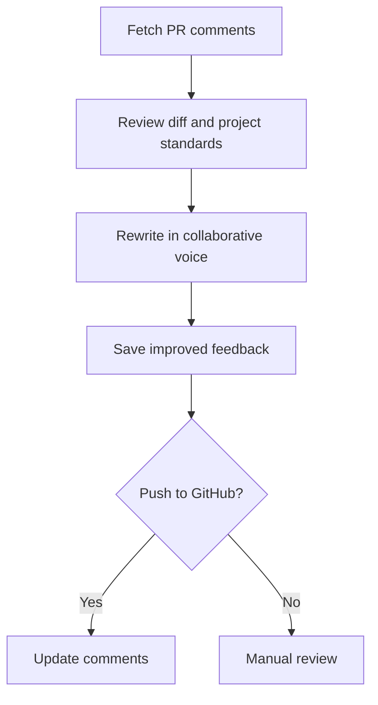
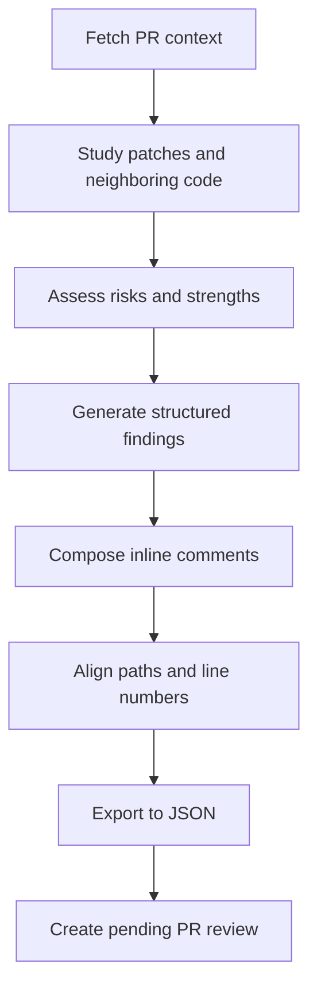
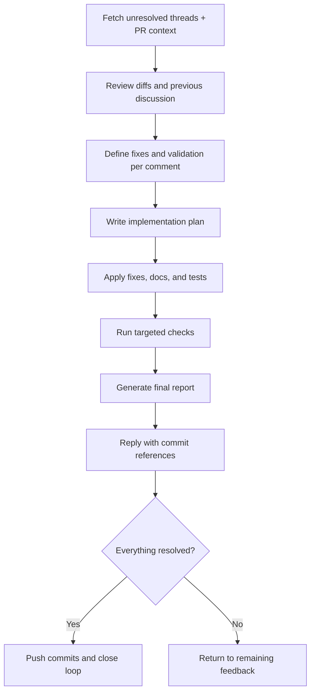

# 🚀 AI Command Library

**Stop writing the same AI prompts over and over.**

Get proven commands for code reviews, PR management, and development workflows that work across Claude, Cursor, Copilot, and Codex.

```bash
# Install once, works everywhere
npx @mkaczkowski/ai-command-library -p claude
```

**✅ One install → Works everywhere**
**⚡ Ready-to-use workflows**
**🔄 Auto-sync across tools**
**📚 Battle-tested commands**

---

## Why This Matters

Every developer wastes time on:

- 🔄 Writing similar prompts for code reviews and PR management
- 🎯 Getting inconsistent AI results across the team
- ⏰ Recreating workflows across projects
- 🤝 Unable to share effective AI commands

**This library fixes all of that.**

You get pre-built workflows, consistent setup, team collaboration, and instant productivity.

---

## Quick Start

Get your first AI command working in 2 minutes:

```bash
# For Claude Desktop/Code
npx @mkaczkowski/ai-command-library -p claude

# For Cursor IDE
npx @mkaczkowski/ai-command-library -p cursor

# For GitHub Copilot
npx @mkaczkowski/ai-command-library -p copilot

# For Codex CLI
npx @mkaczkowski/ai-command-library -p codex-global
```

**Try it now:**

> "Use the PR review enhancement workflow to improve my code review comments"

🎉 Done! Your AI tools now have professional workflows.

---

## How It Works

Think of this as **shared AI prompts organized into plugins**. Instead of writing your own, you get:

```
plugins/pr/              → PR workflows + scripts
plugins/debugger/        → Debugging tools
plugins/jira/            → JIRA integration
       ↓
  link-ai-commands       → Smart sync
       ↓
.claude/commands/        → Commands
.claude/skills/          → Skills (Claude only)
.claude/agents/          → Agents (Claude only)
```

**Core concepts:**

- 📦 **Plugins** - Grouped commands for specific tasks (PR, debugging, JIRA)
- 📝 **Commands** - Step-by-step AI instructions
- 💡 **Skills** - Reusable capabilities (Claude only)
- 🎯 **Agents** - Specialized subagents (Claude only)
- 🔗 **Linking** - Auto-sync to your AI tools

---

## Installation Options

### Direct Usage (No Install)

```bash
npx @mkaczkowski/ai-command-library -p <provider>
```

### Install & Link

```bash
npm install -D @mkaczkowski/ai-command-library
npx link-ai-commands --provider <provider>
```

### Auto-Sync on Install

```json
{
  "scripts": {
    "postinstall": "link-ai-commands --provider claude"
  }
}
```

---

## Choose Your Provider

| Provider        | Destination         | Skills | Agents | Best For                |
| --------------- | ------------------- | ------ | ------ | ----------------------- |
| `claude`        | `.claude/`          | ✅     | ✅     | Project-specific Claude |
| `claude-global` | `~/.claude/`        | ✅     | ✅     | User-wide Claude        |
| `cursor`        | `.cursor/`          | ❌     | ❌     | Cursor IDE              |
| `cursor-global` | `~/.cursor/`        | ❌     | ❌     | User-wide Cursor        |
| `copilot`       | `.github/prompts/`  | ❌     | ❌     | Copilot Workspace       |
| `codex-global`  | `~/.codex/prompts/` | ❌     | ❌     | Codex CLI               |

**Provider-specific notes:**

- **Copilot:** Prompts are flattened to hyphenated names ending in `.prompt.md`
- **Codex:** Commands are flattened to single filenames (e.g., `pr__enhance-review.md`)
- **Skills/Agents:** Only available for Claude providers (project and global)

**Multi-tool setup:**

```bash
# Use multiple AI tools? Run once per provider
npx link-ai-commands --provider claude
npx link-ai-commands --provider cursor
```

---

## Advanced Options

**Install specific plugins:**

```bash
npx link-ai-commands --provider claude --plugins pr,debugger
```

**List available plugins:**

```bash
npx link-ai-commands --list-groups
```

**Use symlinks for live updates:**

```bash
npx link-ai-commands --provider claude --mode symlink
```

**Preview changes:**

```bash
npx link-ai-commands --provider claude --dry-run
```

---

## Available Workflows

Ready-to-use workflows that solve real problems. Each includes commands + helper scripts for GitHub integration.

### 🔧 PR Review Enhancement

Transform blunt code review feedback into collaborative, professional guidance.

**Command:** `pr/enhance-review.md`

**When to use:** After writing initial review comments but before posting them.

```bash
# Step 1: Fetch and rewrite comments
node {{script:pr/scripts/fetch-pr-comments.js}} --pr=123
# Then ask AI: "Enhance my review comments"
# Output: tmp/pr-[PR_NUMBER]-comments.md

# Step 2: Update GitHub
node {{script:pr/scripts/edit-pr-comments.js}} --pr=123
```

**Benefits:** Professional tone, same technical accuracy, stronger team relationships.

<details>
<summary>View workflow diagram</summary>



</details>

---

### ✍️ Create PR Reviews

AI-powered systematic code review with comprehensive issue detection.

**Command:** `pr/draft-review.md`

**When to use:** When you need to review a new PR thoroughly.

```bash
# Step 1: Prepare review findings
node {{script:pr/scripts/fetch-pr-context.js}} --pr=123
# Then ask AI: "Prepare a review for this PR"
# Output: tmp/pr-[PR_NUMBER]-findings.md

# Step 2: Create and post review
# AI generates: tmp/pr-[PR_NUMBER]-review-comments.json
node {{script:pr/scripts/create-pr-review.js}} --input=tmp/pr-123-review-comments.json --pr=123
```

**Benefits:** Catch issues you might miss, professional comments, faster reviews.

<details>
<summary>View workflow diagram</summary>



</details>

---

### ✨ Create Pull Requests

Auto-generate comprehensive PR descriptions from your code changes.

**Command:** `pr/create-pr.md`

**When to use:** When you're ready to create a pull request from your feature branch.

```bash
# AI analyzes your changes and populates the PR template
# Ask AI: "Create a PR using the create-pr workflow"

# Or provide context upfront:
# "Create a PR. I added a user search feature with debouncing to reduce API calls."
```

**What the AI does:**

1. Reads `.github/PULL_REQUEST_TEMPLATE.md`
2. Analyzes commits and diffs since diverging from main
3. Extracts tickets from branch name/commits
4. Identifies new dependencies and test coverage
5. Populates template with reviewer-friendly content
6. Creates PR using `gh pr create`

**Benefits:** Complete descriptions, faster reviews, consistent quality.

---

### 🔗 Create Stacked Pull Requests

**Problem:** Large features are hard to review in a single PR, and breaking them into dependent PRs manually is time-consuming and error-prone.

**Solution:** Automated creation of sequential dependent PRs that build on each other, following conventional commit format with proper dependency tracking.

**What you get:**

- 📚 Work broken into logical, reviewable chunks
- 🔗 Proper dependency chain between PRs
- 🎯 Conventional commit titles with stack position tracking
- ⚡ Faster reviews through smaller, focused PRs

#### Create Stacked PRs (`pr/create-stacked-pr.md`)

**When to use:** When you have a large feature that should be broken into multiple dependent PRs for easier review.

```bash
# Ask your AI:
# "Create stacked PRs for feat auth PROJ-123 implement OAuth2 authentication flow"
```

**What happens:** Your AI:

1. Analyzes the full scope of work needed
2. Breaks it into logical chunks (foundation → features)
3. Plans the stack with proper dependencies
4. Shows you the plan for approval
5. Creates sequential branches with conventional commit format
6. Generates dependent PRs with proper base branches
7. Provides a summary with all PR links and merge order

**What you need to provide:**

- Conventional commit type (feat, fix, refactor, etc.)
- Scope/feature area
- Ticket number
- Description of the changes

**Output:** Series of dependent PRs with proper titles like `feat(auth): add token validation 1/3 (PROJ-123)`

### 🔄 Address Review Feedback

Systematically resolve all review comments with tracking and validation.

**Command:** `pr/address-review.md`

**When to use:** When you have unresolved review comments to address.

```bash
# Step 1: Plan resolutions
node {{script:pr/scripts/fetch-pr-comments.js}} --pr=123 --reaction=+1 --ignore-outdated --include-diff-hunk
# Then ask AI: "Plan resolutions for this feedback"
# Output: tmp/pr-[PR_NUMBER]-address-plan.md

# Step 2: Implement changes
# AI guides you through each planned change
# Output: tmp/pr-[PR_NUMBER]-address-report.md

# Step 3: Reply to resolved comments
node {{script:pr/scripts/reply-to-comments.js}} --pr=123 --dry-run
node {{script:pr/scripts/reply-to-comments.js}} --pr=123
```

**Benefits:** Nothing gets missed, appropriate responses, faster resolution cycles.

<details>
<summary>View workflow diagram</summary>



</details>

---

### 🐞 File JIRA Tickets

Quick JIRA ticket creation with guided workflows:

#### Bug Reports (`jira/create-bug.template.md`)

```bash
# Ask AI: "File a JIRA bug for [issue]"
```

Outputs: Complete description + ready-to-run `jira issue create` command

#### Technical Debt (`jira/create-tech-debt.template.md`)

```bash
# Ask AI: "Create a technical debt ticket for [work]"
```

Outputs: Structured ticket with What/Where/Why + acceptance criteria

#### Flaky Tests (`jira/create-flaky-test.template.md`)

```bash
# Ask AI: "File a flaky test ticket for [test]"
```

Outputs: Complete diagnostic details + reproduction steps

**Prerequisite:** Install [`jira-cli`](https://github.com/ankitpokhrel/jira-cli) and authenticate.

---

## Script Integration

Commands reference helper scripts using placeholders that work everywhere:

```bash
# This works across all providers:
node {{script:pr/scripts/fetch-pr-comments.js}} --pr=123

# Resolves to correct path for each provider:
# Claude:  .claude/commands/pr/scripts/...
# Cursor:  .cursor/commands/pr/scripts/...
# Copilot: .github/prompts/pr/scripts/...
# Codex:   ~/.codex/prompts/pr/scripts/...
```

**Available placeholders:**

- `{{script:path/to/script.js}}` - References helper scripts
- `{{path:commandsRoot}}` - References commands directory

---

## Helper Scripts Reference

<details>
<summary><strong>📥 Data Fetching</strong></summary>

- `fetch-pr-comments.js` - Get review comments with filtering
- `fetch-pr-context.js` - Gather PR metadata, files, commits

```bash
node {{script:pr/scripts/fetch-pr-comments.js}} --pr=123 --reaction=+1
node {{script:pr/scripts/fetch-pr-context.js}} --pr=123
```

</details>

<details>
<summary><strong>📤 GitHub Integration</strong></summary>

- `create-pr-review.js` - Submit comment JSON as review
- `edit-pr-comments.js` - Update existing comments
- `reply-to-comments.js` - Post resolution acknowledgments

```bash
node {{script:pr/scripts/create-pr-review.js}} --input=tmp/pr-123-review.json --pr=123
node {{script:pr/scripts/edit-pr-comments.js}} --pr=123
node {{script:pr/scripts/reply-to-comments.js}} --pr=123 --dry-run
```

</details>

💡 All scripts support `--help` for usage details.

---

## Prerequisites

- **Node.js 22+** and **npm 10+**
- **[GitHub CLI](https://cli.github.com/)** for PR workflows
  - Run `gh auth login` with `repo` scope
  - Enterprise users: set `GH_HOST` or use `--repo` flags

### Alternative Installation

Install directly from GitHub:

```bash
npm install -D git+https://github.com/mkaczkowski/ai-command-library.git
```

---

## Development & Contributing

### Setup

```bash
git clone https://github.com/mkaczkowski/ai-command-library.git
cd ai-command-library
npm install
```

### Code Quality

```bash
npm run lint           # Check code style
npm run format:check   # Verify formatting
npm run lint:fix       # Fix issues
npm run format         # Apply formatting
```

### Repository Structure

```
ai-command-library/
├── plugins/              # Plugin groups
│   ├── pr/              # PR workflows
│   ├── debugger/        # Debugging tools
│   ├── jira/            # JIRA integration
│   └── common/          # Shared utilities
├── providers/           # Provider configs
├── scripts/             # Core linking logic
└── bin/                 # CLI entry point
```

### Plugin Organization

Each plugin group can contain:

```
{group}/
├── commands/      # Markdown command templates + scripts
├── skills/        # Claude Code Skills (Claude only)
└── agents/        # Claude Code Subagents (Claude only)
```

**Available groups:**

- **pr/** - Pull request workflows and utilities
- **debugger/** - Debugging agents and skills
- **jira/** - JIRA ticket creation
- **common/** - Cross-cutting utilities

### Release Process

1. Update `package.json` version and `CHANGELOG.md`
2. Run `npm run release` to verify
3. Publish: `npm publish --access public`
4. Push release commit and tag

---

## Support & Community

### Need Help?

- 🐛 **Bug reports:** [GitHub Issues](https://github.com/mkaczkowski/ai-command-library/issues)
- 💡 **Feature requests:** [GitHub Issues](https://github.com/mkaczkowski/ai-command-library/issues)
- 🔒 **Security concerns:** See [`SECURITY.md`](SECURITY.md)

### Contributing

We welcome contributions:

- Add new workflows
- Improve existing templates
- Enhance provider support
- Update documentation

---

## License

Released under the [MIT License](LICENSE).

**Happy coding!** 🚀
