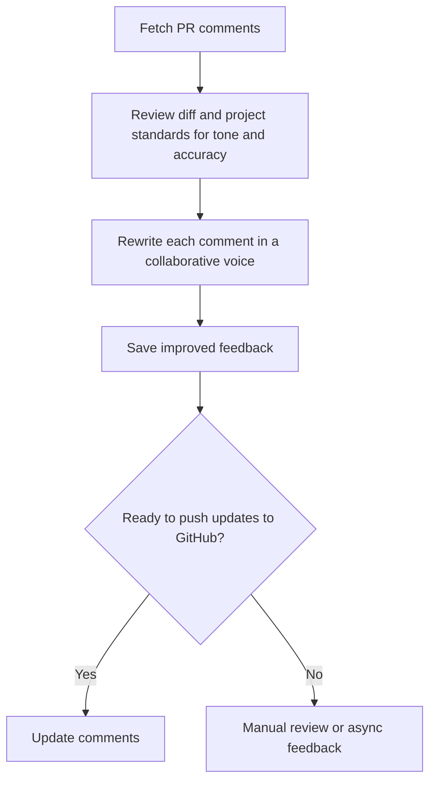
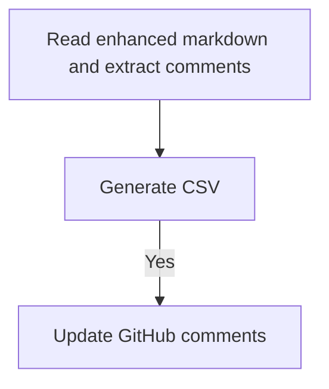
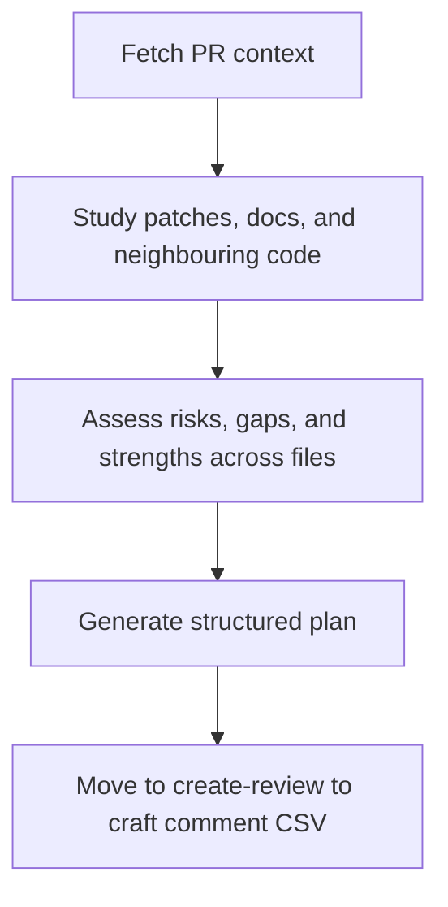
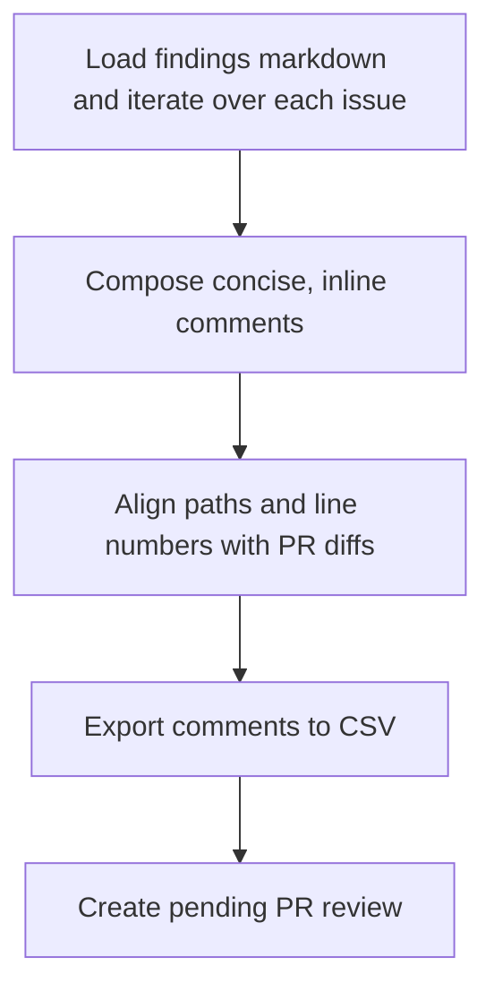
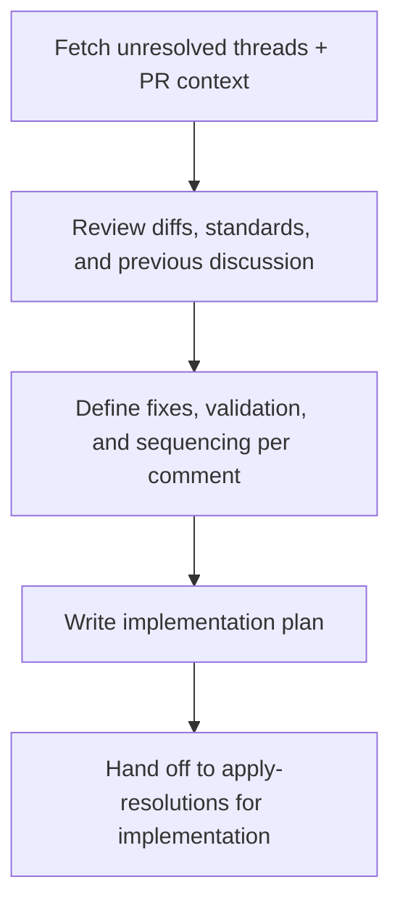
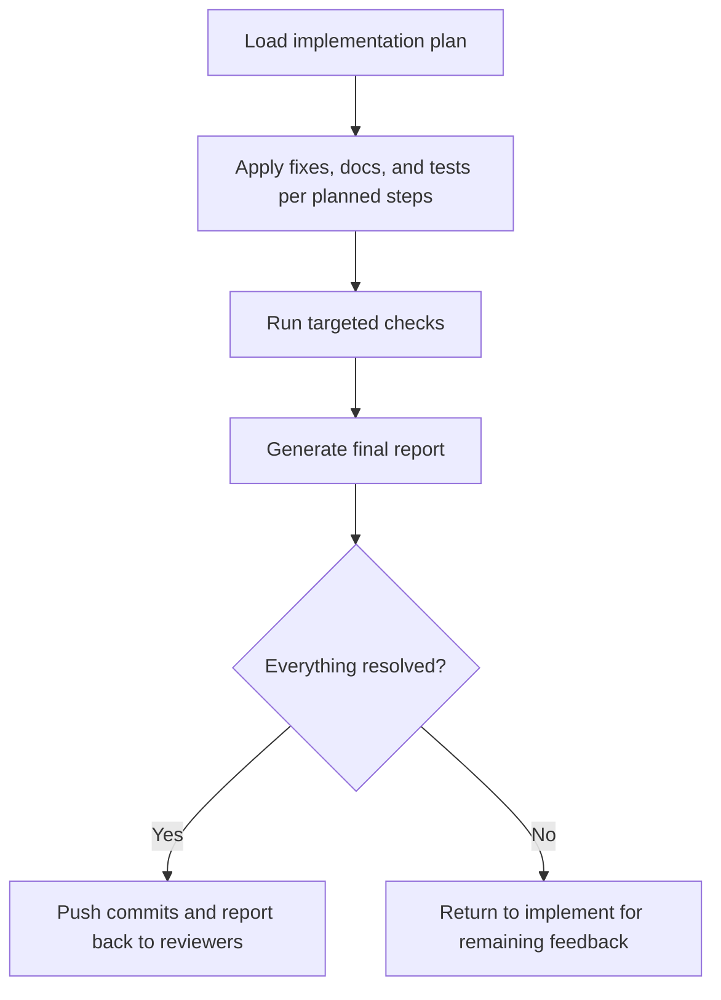

# AI Command Library

Reusable AI agent commands and helper scripts that plug into Claude Desktop, Cursor, Codex, and other tooling. The project ships a provider-agnostic command catalogue plus a CLI that syncs commands into the correct provider-specific folders.

## Features

- Canonical command source under `library/commands/` shared by all providers (markdown stored as `*.template.md`)
- Provider metadata (`providers/*.json`) that maps source folders to destinations
- Node-based CLI (`link-ai-commands`) for copying or symlinking commands into tool-specific directories
- GitHub PR utilities for fetching context, preparing feedback, and updating comments

## Prerequisites

- Node.js 22 or newer
- npm 10+
- [GitHub CLI](https://cli.github.com/) for the PR helpers; authenticate with `gh auth login` and ensure the `repo` scope is granted. Enterprise users can set `GH_HOST` or pass `--repo` to the scripts.

## Installation

```bash
npm install -D @mkaczkowski/ai-command-library
```

The package publishes the CLI as a binary named `link-ai-commands`.

If you prefer installing straight from GitHub:

```bash
npm install -D git+https://github.com/mkaczkowski/ai-command-library.git
```

## Linking Commands

`link-ai-commands` copies or symlinks everything under `library/commands/` into the folders your AI tools expect. Run it from a project root after adding the package (or globally once the CLI is installed).

### Quick Start

```bash
npx link-ai-commands --provider claude
```

The example above populates `.claude/commands/pr` with the canonical PR workflows.

### Provider Defaults

| Provider id     | Default destination  | Typical use case                                         |
| --------------- | -------------------- | -------------------------------------------------------- |
| `claude`        | `.claude/commands`   | Project-scoped commands for Claude Desktop / Claude Code |
| `claude-global` | `~/.claude/commands` | Machine-wide Claude command catalogue                    |
| `cursor`        | `.cursor/prompts`    | Project-scoped commands for Cursor IDE (flattened files) |
| `cursor-global` | `~/.cursor/prompts`  | Machine-wide Cursor command catalogue (flattened files)  |
| `codex-global`  | `~/.codex/prompts`   | Machine-wide prompts for the Codex CLI                   |

Run `npx link-ai-commands --list-providers` at any time to see bundled IDs and destinations.

> **Cursor note:** Cursor keeps prompts flat. Markdown commands are flattened into filenames joined with `__` (for example `pr/enhance-review/rewrite-comments.md` becomes `pr__enhance-review__rewrite-comments.md`), while helper scripts stay grouped under `scripts/`. If two flattened commands would clash, the linker aborts so you can rename them.

### Script References

Commands that instruct agents to run helper scripts should reference the canonical path using the placeholder syntax
`{{script:<relative-source-path>}}`. During linking the placeholder resolves to the provider’s actual destination. For
example:

```bash
node {{script:pr/scripts/fetch-pr-comments.js}} --pr=123
```

Links to `.claude/commands/pr/scripts/fetch-pr-comments.js` for Claude, `.cursor/prompts/scripts/fetch-pr-comments.js`
for Cursor, and `~/.codex/prompts/pr/scripts/fetch-pr-comments.js` when syncing the Codex catalogue.

- Use `{{path:commandsRoot}}` whenever instructions refer to the location of synced prompts. The linker resolves it to
  `.claude/commands` for project-scoped Claude commands, `~/.claude/commands` for global installs, `.cursor/prompts`
  for Cursor projects, and so on.

### Useful Flags

- `--destination <dir>` sends the files somewhere else (relative paths resolve from the current directory).
- `--mode symlink` keeps a live link to the library instead of copying files. On Windows, the CLI automatically falls back to copy mode if junctions are unavailable.
- `--dry-run` prints the planned actions without touching the filesystem — combine it with any other flags to preview results.

## Command Catalogue

The library groups commands by PR workflow. Each markdown template (`*.template.md`) contains step-by-step instructions intended for an AI assistant. During linking the `.template` suffix is removed so providers receive plain `.md` files. Run the linked helper scripts first so the command has the data it expects.

### Enhance Existing Comments

#### `library/commands/pr/enhance-review/rewrite-comments.template.md`

- **Purpose:** Rewrite existing reviewer comments so they sound collaborative while keeping the original technical request intact.
- **Typical run:** Use `node scripts/fetch-pr-comments.js` to gather the latest review threads, then launch this command to polish each comment. If the source comment includes a markdown `AI` section, treat it as a private hint—pull guidance from it but omit the section from the rewritten response.
- **Output:** A markdown report at `tmp/pr-[PR_NUMBER]-comments.md` ready to sanity check before sharing or exporting.

#### Flow



#### `library/commands/pr/enhance-review/update-review.template.md`

- **Purpose:** Prepare bulk updates for existing GitHub comments after you finish rewriting them.
- **Typical run:** Execute this command once you have refined comments in the markdown output. It guides you through generating a CSV file that maps old comment IDs to the improved text so `scripts/edit-pr-comments.js` can submit updates via the GitHub API.
- **Output:** CSV rows that the `edit-pr-comments.js` script turns into actual comment edits.

#### Flow



### Create New Review Comments

#### `library/commands/pr/draft-review/prepare-review.template.md`

- **Purpose:** Collect PR context and outline a full review plan before you start drafting comments.
- **Typical run:** Start by running `node scripts/fetch-pr-context.js` (and the comment fetcher if needed) so the workspace has up-to-date metadata, files, and diffs. The command then helps the assistant catalog issues, suggested fixes, and supporting references.
- **Output:** Structured findings stored in the workspace (usually under `tmp/`) that are ready to be turned into actionable review comments.

#### Flow



#### `library/commands/pr/draft-review/create-review.template.md`

- **Purpose:** Convert prepared review findings into individual comment bodies that GitHub can accept.
- **Typical run:** Point this command at the findings produced by `prepare-review.md`. It walks through generating reviewer-friendly language, maps each note to its file and line, and shapes the result into the CSV schema consumed by `scripts/create-pr-review.js`.
- **Output:** A CSV file containing comment drafts plus any required metadata for bulk submission.

#### Flow



### Address Review Feedback

#### `library/commands/pr/address-review/prepare-resolutions.template.md`

- **Purpose:** Build an actionable resolution plan for every unresolved 👍 review comment without touching code yet.
- **Typical run:** Refresh comment data with `node scripts/fetch-pr-comments.js --reaction=+1 --ignore-outdated --include-diff-hunk` (and optionally `node scripts/fetch-pr-context.js` for richer metadata), study linked standards, then document the steps needed to satisfy each reviewer.
- **Output:** A markdown playbook saved to `tmp/pr-[PR_NUMBER]-address-plan.md` cataloguing required code/doc changes, validation, and open questions per comment.

#### Flow



#### `library/commands/pr/address-review/apply-resolutions.template.md`

- **Purpose:** Execute the approved plan, implement the fixes, and capture validation results for reviewers.
- **Typical run:** Follow the plan from `prepare-resolutions.md`, apply each change, stage commits that reference the associated comment, and record validation outcomes as you go.
- **Output:** A detailed report at `tmp/pr-[PR_NUMBER]-address-report.md` summarizing commits, tests, and any follow-up work tied to each resolved comment.

#### Flow



### PR Automation Scripts

The `library/commands/pr/scripts/` folder contains Node.js helpers that automate API calls the markdown commands rely on:

- `fetch-pr-comments.js` retrieves review comments with options for ignoring outdated threads or filtering by reaction.
- `fetch-pr-context.js` gathers supplemental PR metadata (files, commits, participants) so commands can reference the latest state.
- `create-pr-review.js` submits the prepared comment CSV as a pending GitHub review.
- `edit-pr-comments.js` updates existing review comments based on the CSV produced by the update workflow.

Run these scripts with `node scripts/<script-name> [options]`. Use `--help` on any script to inspect supported flags.

## Automating Syncs

- Add `link-ai-commands --provider <id>` to your project's `postinstall` script so command folders stay up to date.
- In multi-tool environments, run the CLI once per provider target.
- CI pipelines can execute the CLI during build steps to verify the destination folders exist before publishing artifacts.

## Development

Clone and install dependencies:

```bash
git clone https://github.com/mkaczkowski/ai-command-library.git
cd ai-command-library
npm install
```

Run linting and formatting checks:

```bash
npm run lint
npm run format:check
```

Automatically fix lint issues and apply formatting:

```bash
npm run lint:fix
npm run format
```

### Releasing

1. Update `CHANGELOG.md` and bump the version in `package.json`.
2. Run `npm run release` to verify linting and formatting.
3. Publish with `npm publish --access public` (requires an npm token with publish rights).
4. Push the release commit and tag to GitHub.

## Repository Layout

```
ai-command-library/
├── library/commands/      # Canonical command source
├── providers/             # Provider mapping metadata
├── scripts/link-commands.js
└── bin/link-ai-commands.js
```

## Support & Feedback

- Report bugs and feature requests via [GitHub issues](https://github.com/mkaczkowski/ai-command-library/issues).
- Security reports should follow the guidance in [`SECURITY.md`](SECURITY.md).

## License

Released under the [MIT License](LICENSE).
